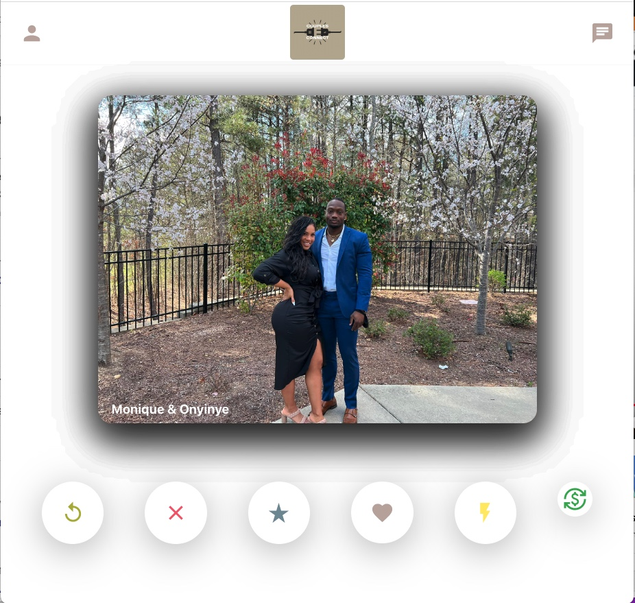
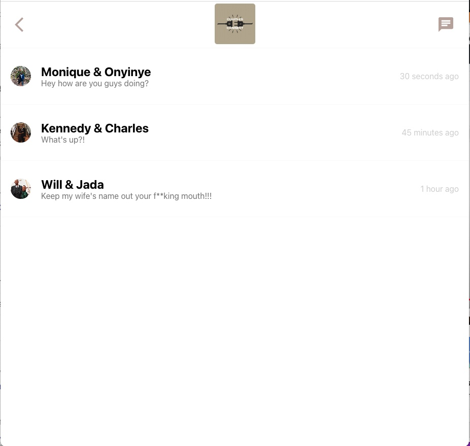
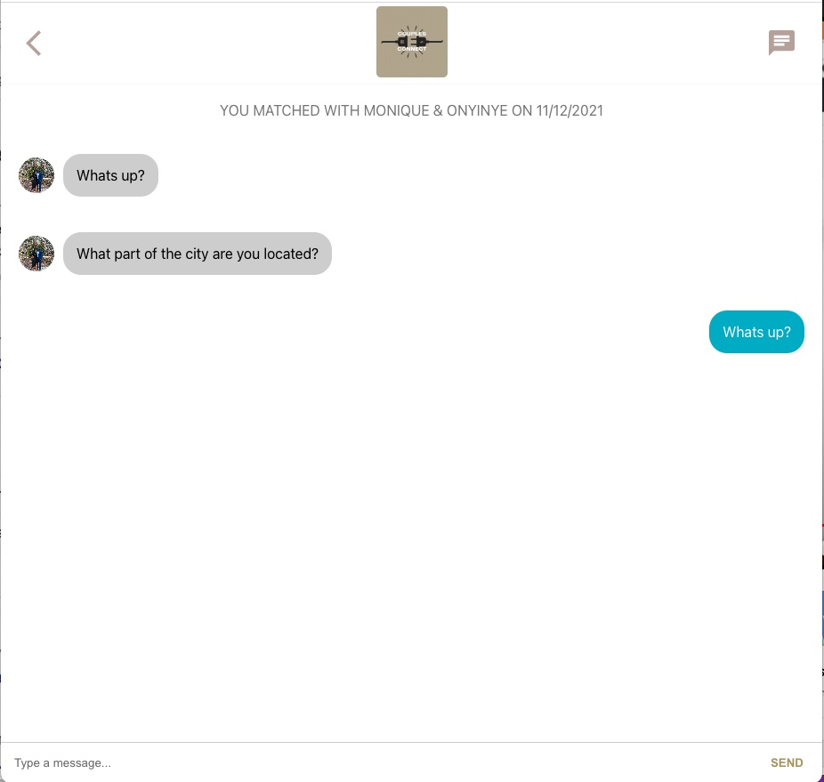

# Couples Connect

## App Overview

A networking app for couples to connect with other couples who have similar interests. 
Pulling from the react-tinder-card API. Displaying information to the browser using ReactJS,
MaterialUI styled CSS.

## Developer

 * Onyinye Okwuosa
    * [LinkedIn](https://www.linkedin.com/in/onyinye-okwuosa-csm-303a27a8/)
    * [Github](https://github.com/okwuosa34)
    

## Project Status
The website database is stored in Firebase which will also host it.

## Project Screenshot(s)

- HomePage:

- InboxPage:

- ChatscreenPage:

